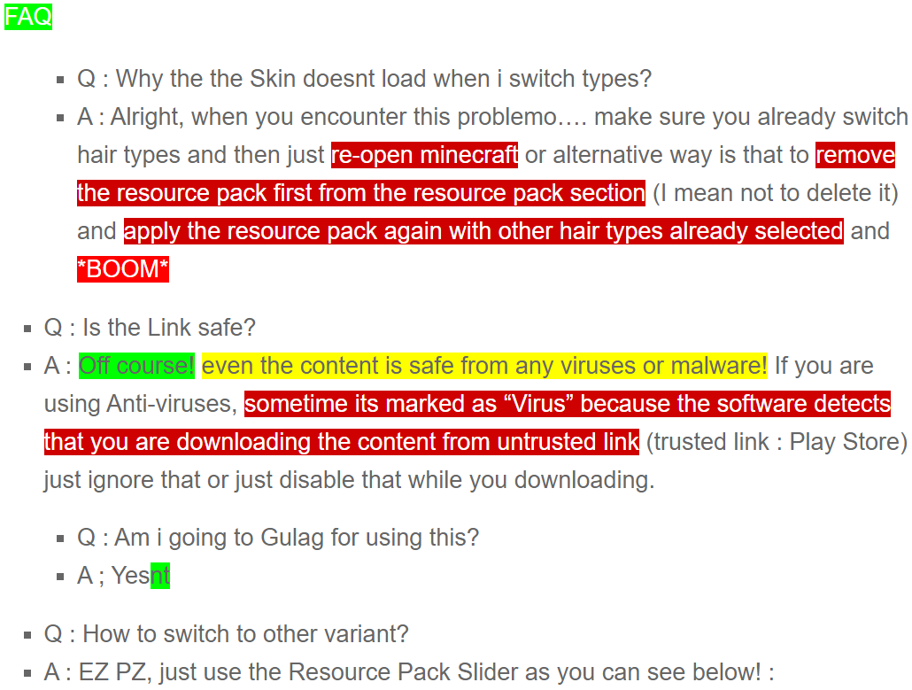

⠀⠀⠀Bored with usual Minecraft? No Worries, you can try this  …Addon! It will gives you a meme vibe inside the pixellated Minecraft! Its inspired by walking WIDE Putin ( I have no idea why i got some inspiration by just a person walking through the hallway). Putting memes in to your Minecraft isnt bad right?  :D.

⠀⠀⠀Scared that you’re going to Gulag? Just dont be that scared, its just a cloned version of “”Him””. I call the cloned one as “” and he is good at walking!

⠀⠀⠀Putimir’s . Alright, check this :

⠀⠀⠀On this latest update, i bring up a few changes to the Model. I can tell maybe this is the last version since i’ve fixed numerous bugs that appear within the gameplay but 

**1. More Higher Scale & Texture Resolution!**

⠀⠀⠀ that the model  also the model now up-scaled a little bit, so it wont kinda look 

**2. No More Annoyying Long Hand!**

⠀⠀⠀Yep, das right.. In this update i bring up some fixes on the First Person Perspective that  that may decrease your experience while using this add-on.

⠀That’s it.. ! I just highlight some of the Important changes on this update.

⠀PssSsTsTSTsstTS!  so 

⠀⠀1. At the first variant, you’ll see that its just a usual mother Russia sized man. Nothing scared about him, right? 

⠀⠀The normal one will called as…  off course, just choose to the Normal one using the Texture Pack Slider to get this variant. Its has less vertices than the other variants, so it’ll more faster to load when you applying this on the Resource pack. Its just scaled into 0.545×0.545×0.545 in order to fit the height of Minecraft Normal  Skin Character.

⠀⠀2. The second one, Is the Wide one. This is variant is heavily based on the original meme and its just 

⠀Come to the Wide one, its has dozens of vertices that may slowdown the loading time. The model stretched to the X-axis and the scale is made to be closest to the Original Putin Walk Meme. This variant named as ““,  😀

⠀⠀3. The third one, is the Wide variant but the wide is reversed to the front ( )

⠀As i said earlier, its just reversed Wide putin but the Wide is scaled to the Front wich is Y-axis. The scale is still the same though, its has 0.545x1x2.157 scale form. You can find this at the texture pack, just find “” to select this variant. 

⠀Welcome to the Cursed Area! Here’fore’s already cursed but do you want some more? I have more Explicit content for you! Here we have 2 other variants that willn’t regret you at first (). **

**1. Wide Putimir but More Wider to the Front!**

⠀Well, its just wide Putimir but the scale reversed into the front! You can call it ““. 

⠀The “More Wide” variant has more vertices than the “Usual Wide” variant. It may really slowdown the Loading time, just be patient when loading any of these.

⠀Since the MCPEDL Team requires me to provide more detailed description, well i’ll definitely gives that!. You can find this variant as “” at the resource file, its done by stretching more wildly to Y-axis. Its scaled with 9.017 values to the Y-axis to achieve this kind of Man!

2. The Wide putimir isnt Wide Enough? Here’t’s !! Get your Wide Enough Putimir down below! ! !

⠀, This variant has alot of uses in the game!  for Example. You can find this Monstrosity Model as “” because i named it like that :v. Made by scaling the X-axis with the same value as before (9.017) in order to achieve this. 

⠀ Lets take a look at the last in-game Image preview :

⠀Now that’s a lot of **. . Leave any feedback down below, dont be shy! If you encounter any kind of bugs or problems, just also leave it on the comment section or you can contact me on the Discord!

⠀Dont Worry, .

[>>> Discord <<<](https://discord.com/invite/j7ncyRe)

# **FAQ**

⠀Curious with how’s the pack looks like? You can see the Video Preview listed below.

# Preview

  

# Changelog

- Fixed Link that caused by typo (Sorry because i filled the submission while im sleepy).
- Changed the title to fixed name.
- Revert The Pack Banner to Original.
